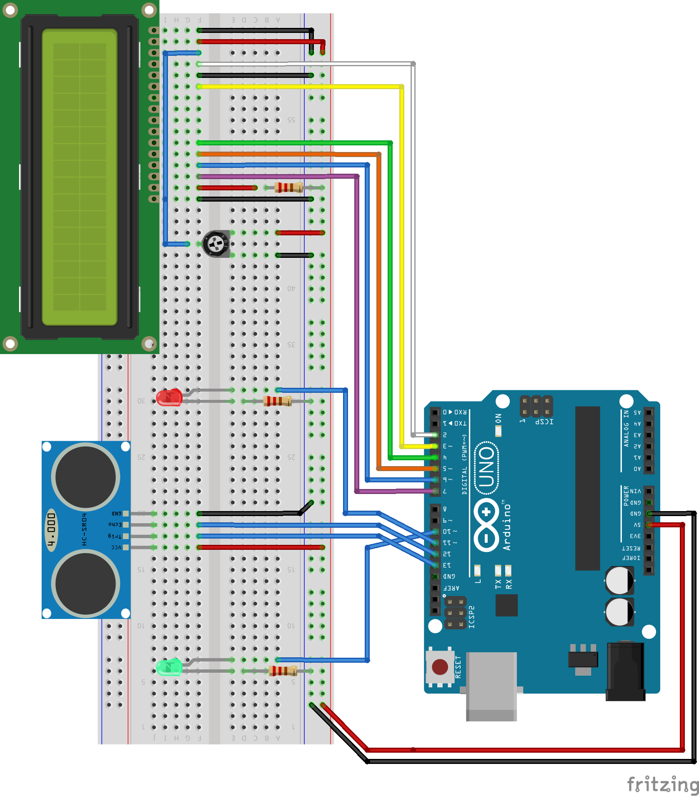

# Arduino HC-SR04 Ultrasonic Range Alarm

This Arduino sketch makes use of the HC-SR04 ultrasonic range detector sensor and a red and green LED that illuminate according to range.

## What It Does

- When an object is detected at 20cm or less the green LED illuminates
- When an object is detected at 8cm or less the red LED illuminates

## Materials

- Arduino Uno
- HC-SR04
- (2) 220 ohm resistors
- Red LED
- Green LED

## Wiring

## Sketch
[HC-SR04.ino](HC-SR04.ino)